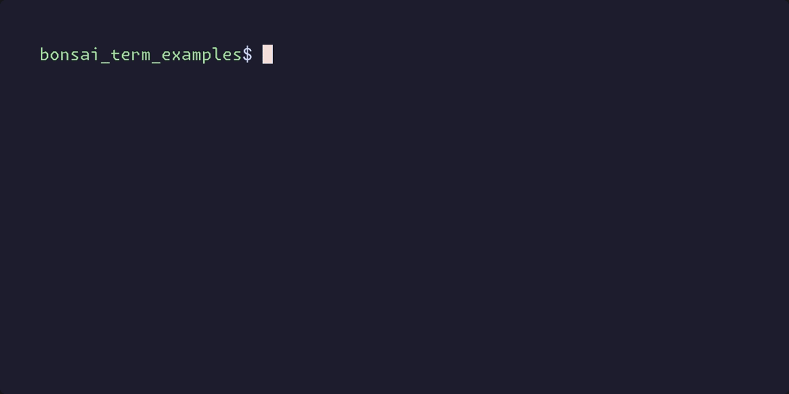

# Bonsai Term

Bonsai_term is a library that lets you write Terminal UIs (TUIs) using
OCaml. It uses the same programming model as the `bonsai_web` library.

`bonsai_term` is released across 4 repositories:

- [bonsai_term](https://github.com/janestreet/bonsai_term): The "core" bonsai term library.
- [bonsai_term_examples](https://github.com/janestreet/bonsai_term_examples): Some bonsai_term examples. 
- [bonsai_term_components](https://github.com/janestreet/bonsai_term_components): Some re-usable bonsai term components.
- [bonsai_term_test](https://github.com/janestreet/bonsai_term_test): For writing bonsai term tests.

## Demos

Here are some of our demos. The source code for these (and others) is located in our [examples repo](https://github.com/janestreet/bonsai_term_examples/tree/with-extensions/hello_world).

## Getting started

1. If you are new to OCaml - or if you haven't already - **install
   [opam](https://opam.ocaml.org/)**. It is OCaml's package manager
   and we'll be using it to install `bonsai_term` and its dependencies.
   The specific installation instructions depend on your platform. You
   can find platform-specific instructions
   [here](https://opam.ocaml.org/doc/Install.html).
2. `bonsai_term` uses [OxCaml](https://oxcaml.org/) so the next thing
   you'll want to do is install `oxcaml` by following the instructions
   [here](https://oxcaml.org/get-oxcaml/).
3. Run `opam install bonsai_term`. (This will install `bonsai_term` and its dependencies).

At this point you should now have `bonsai_term` "installed".

To learn how to use `bonsai_term` you can read its MLI `src/bonsai_term.mli` and / or look
at some examples in the
[bonsai_term_examples](https://github.com/janestreet/bonsai_term_examples) repo.

To learn how to use `bonsai`, you can read the docs in
[bonsai_web](https://github.com/janestreet/bonsai_web/blob/master/docs/guide/00-introduction.md).
(most of those docs are aimed at the "web" version of bonsai, so the "vdom" bits may not
apply, but the "effect" / "state-fulness" and ways of doing "incrementality" all should
transfer from `bonsai_web` into `bonsai_term`).

To learn how to use `ocaml` here are some good resources:

- [Learn OCaml documentation](https://ocaml.org/docs)
- [CS 3110 Course](https://cs3110.github.io/textbook/cover.html)
- [Real World OCaml](https://dev.realworldocaml.org/)

If you followed the install instructions at the top of this page, you can skip the
"Install" instructions on the above links.
